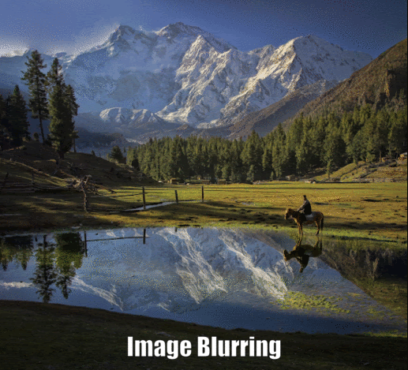
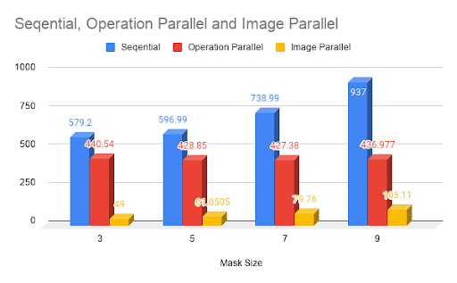
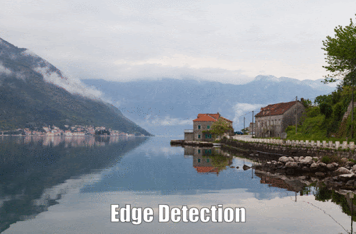
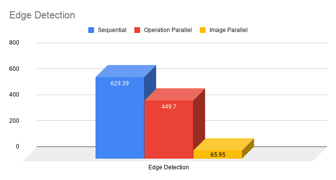
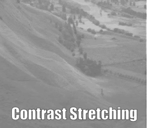
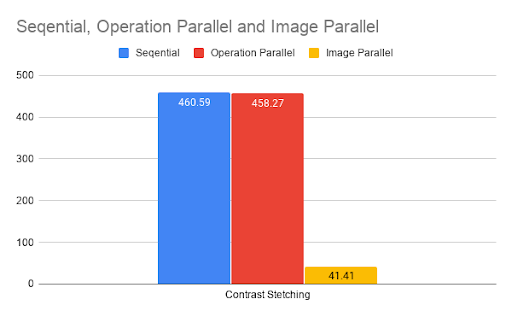
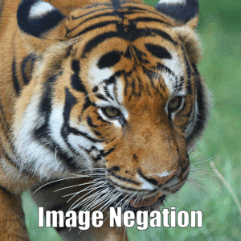
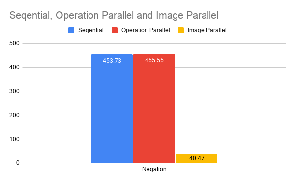

# Parallel-Programming
Implementation of an Image Processing Library for time consuming operations such as Image Blurring,Negation,Edge Detection and Contrast Stretching with help of sobel and gaussian Filters


## Getting Started

1. Clone the Repos/Project
2. For libpng, run:
```
sudo apt-get install libpng-dev
```
For zlib, run:
```
sudo apt-get install zlib1g-dev
```
3. run the programm
### Prerequisites
 For libpng, run:
```
sudo apt-get install libpng-dev
```
For zlib, run:
```
sudo apt-get install zlib1g-dev
````
### Installing/ Compilation
##Compile
```
gcc -o filename -fopenmp filename.c -lpng
```
##run
```
./filename
```
And repeat

```
until finished
```

## Running the tests

Rest all the things will be done by the compiler i.e taking an image as a input performing operations etc.

### Break down into end to end tests

### Operations Performed and Speedup Achived
1)Image blurrring
<figure>
 
 <figcaption>
 <p></p> 
 </figcaption>
</figure>
<figure>
 
 <figcaption>
 <p></p> 
 </figcaption>
</figure>

2)Edge Detection
<figure>
 
 <figcaption>
 <p></p> 
 </figcaption>
</figure>
<figure>
 
 <figcaption>
 <p></p> 
 </figcaption>
</figure>

3)Contrast Stretching
<figure>
 
 <figcaption>
 <p></p> 
 </figcaption>
</figure>
<figure>
 
 <figcaption>
 <p></p> 
 </figcaption>
</figure>
4)Image Negation
<figure>
 
 <figcaption>
 <p></p> 
 </figcaption>
</figure>
<figure>
 
 <figcaption>
 <p></p> 
 </figcaption>
</figure>

### And coding style tests

Procedural Programming

## Deployment

Not Yet 
```
Work in Progress
```

## References

* [OpenMP](https://www.youtube.com/playlist?list=PLLX-Q6B8xqZ8n8bwjGdzBJ25X2utwnoEG) -Introduction to Parallel Programming by Tim Matson
* [PNG](http://www.libpng.org/pub/png/pngmisc.html#lists) -PNG Image Specification
* [PNG](https://libpng.sourceforge.io/index.html) - PNG Reference Library: libpng
* [OpenMP](https://www.openmp.org/) - OpenMP docs

## Contributing

//Please read [CONTRIBUTING.md](https://gist.github.com/rahulsonone1234) for details on our code of conduct, and the process for submitting pull requests to us.

## Versioning

We use [SemVer](http://semver.org/) for versioning. For the versions available, see the [tags on this repository](https://github.com/your/project/tags). 

## Authors

* **Team Trident** - *work* - [rahulsonone1234](https://github.com/rahulsonone1234)
                            - [rushikeshkorde](https://github.com/rushikeshkorde)
                            - [saurabhzade](https://github.com/saurabh077)

See also the list of [contributors]() who participated in this project.

## License
## Acknowledgments

```
Dr. Nileshchandra Pikle Sir 
```
who guided us in overall project development life cycle
